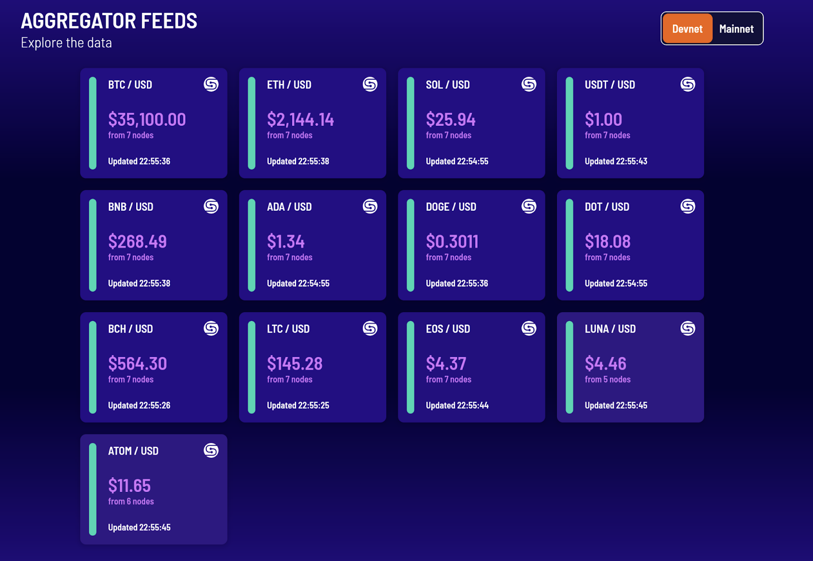

# Introducing Switchboard

Switchboard is building community curated oracle feeds on Solana.

We want to enable anyone in the SOL community to push any form of data, whether
financial time series or non-financial event-based data, on-chain and to help
power the next generation of decentralized applications.

## Why Switchboard & Why Solana

- Oracles are a critical component of DeFi infrastructure that enable smart
  contracts to interact with real world data. Too many solutions have focused on
  financial and time series data rather than generalizing to all forms of data.

- Data on-chain isn’t free and there needs to be a sustainable curation &
  incentive mechanism to determine what data will be maintained on-chain.

- Data integrity and incentive mechanisms need to be driven by the market and
  community. Scaling these sorts of decisions and supporting a broader set of
  data feeds requires a high performance, shared state chain.

- By focusing on community and market driven curation, Switchboard enables a
  much broader set of data providers and consumers to decide what they would
  like to see on-chain. The long tail of data is much more than just price
  feeds!

<!--truncate-->

## Switchboard Devnet Beta

In line with expanding community access, we’ve launched our devnet beta so that
community members can begin building.

[Switchboard.xyz](https://switchboard.xyz/#/explorer)

Our initial aggregators are cryptocurrency and sports feeds, as requested by the
community. Given Solana’s low transaction cost and speed, we’re working on
supporting a much broader set of feeds than traditionally available from
decentralized oracles. It’s our belief that Solana will become one of the
premier destinations for developers building high performance, decentralized
applications and we can’t wait to see what you’ll build with Switchboard.

You can find more about building using Switchboard and integrating Switchboard
feeds into your Solana application on our
[documentation](https://switchboard-xyz.github.io/switchboard-api/).

We’ll also be hosting a technical workshop for the
[Solana hackathon](https://airtable.com/shr2P5e3aLRLXdy7E/tblgRI4QqKdkY6Ja2) on
[Thursday May 28th at 11:30 AM EDT](https://www.twitch.tv/solanatv)

If you’re building an application relying on on-chain data feeds or would like
to see a certain type of data on-chain, feel free to reach out to us on our
[Discord](https://discord.gg/sNeGymrabT) /
[Telegram](https://t.me/switchboardxyz). We’d love to hear from you! Finally,
give us a follow on [Twitter](https://twitter.com/switchboardxyz) to stay on top
of latest developments!
