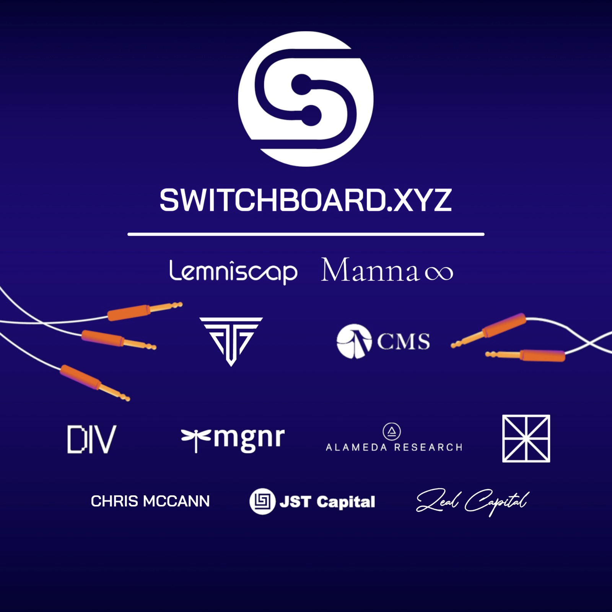

# Switchboard raises 3.5MM seed and announces Solana Mainnet Beta

We’re excited to share that Switchboard has raised a $3.5MM seed round led by
Lemniscap to build out our community curated oracle network on Solana. This
round of funding allows us to continue our mission to bring support for the long
tail of data feeds on-chain in a decentralized, high-performance manner.

Participating investors included CMS Holdings, Taureon, Alameda Research, MGNR,
Collab + Currency, Divergence Ventures, Zeal Capital, SCC Investments, JST
Capital as well as angel investors Chris McCann, former Solana General Counsel
Ryon Nixon and Recur executive Paul J Martin among others.

<!--truncate-->

Chris McCann, an early seed investor in Solana, FTX, and backer of Switchboard
said:

> “The Switchboard team is building on-chain data feeds and oracles which are
> some of the most critical infrastructure layers for all DeFi projects on
> Solana. “Every single DeFi project needs price oracles to rely on for their
> own products to function properly. On top of this, Switchboard has generalized
> their product to include all kinds of data feeds outside of pure price, which
> will all be community-driven and adopted. “This, in combination with Solana’s
> low latency and high throughput will create a reliable data layer the whole
> ecosystem can rely on.”

Switchboard was incubated by Manna, a proprietary trading and investment firm
founded by Zach Bruch and Chris Hermida. Bruch has worked and held leadership
positions at three of the largest and most established institutional trading
desks in the industry — Kraken, Cumberland/DRW, and JST Capital. Hermida
formerly led trading in Europe for Circle, and most recently was Global Co-head
of OTC trading at JST Capital.

## Mainnet Beta

As part of the raise, we’re also excited to announce our mainnet beta.
Switchboard is the first oracle network to enable feeds on Solana’s mainnet —
allowing developers to take advantage of Solana’s low transaction fees and fast
confirmation times.

If you’re building an application relying on on-chain data feeds or are
interested in publishing data on-chain or running a node, reach out to us on our
[Discord](http://discord.switchboard.xyz/) /
[Telegram](http://telegram.switchboard.xyz/) to
[participate in our mainnet beta](https://forms.gle/ese7yF8UfA7naHxMA). Follow
us on [Twitter](http://twitter.switchboard.xyz/) to stay on top of the latest
developments!

Team Switchboard
