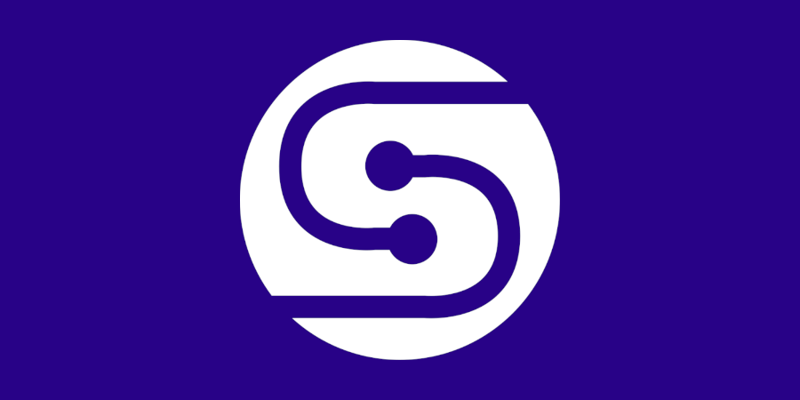

# Intro to Switchboard

Switchboard is a community-driven, decentralized oracle network built on Solana
that allows anyone to publish on-chain data for smart contract developers to
reliably build upon.

## What is an Oracle?

Smart contracts are the building blocks of web3 and can be thought of as the
logic behind programmable money, although their use cases extend well beyond
just monetary transactions. A smart contract encapsulates some pre-defined logic
allowing anonymous participants to interact without a trusted intermediary. More
complex smart contracts might rely on external data from the web but blockchains
do not have the capability of directly relaying this information. Enter oracles.

Oracles are the gateway between a blockchain and the real world, providing the
mechanisms to arrive at a reliable consensus for a single data point when given
multiple sources. Oracles can then determine the most reliable value of the data
point after examining the provided answer of each data source. In this way,
oracles increase information integrity by removing the risk of a single point of
failure or outlier. Oracle services have many applicable uses in blockchain
based applications today, such as:

- Determining the current price of an asset for collateralized lending

- Determining the state of a tracking number to auto settle funds on arrival

- Determining the current standings of the MLB for fantasy sports rankings

Oracles can be used for a variety of data sets as long as there is a reliable
way to source the information.

<!--truncate-->

## What is Switchboard?

Switchboard is a community-driven, decentralized oracle network built on Solana
that allows anyone to publish on-chain data for smart contract developers to
reliably build upon. Switchboard is a community governed protocol — if
additional on-chain data is needed, head over to our
[documentation](https://app.gitbook.com/@switchboard-1/s/switchboard/) to learn
how to spin up your own data feeds. [Or reach](mailto:hello@switchboard.xyz) out
to learn more.

Solana was chosen for its sub-second transaction speed, allowing faster refresh
rates of on-chain data to help support it’s thriving developer ecosystem.
Developing an oracle solution in this high-availability environment poses its
own set of challenges that the Switchboard team is excited to solve!

Switchboard gets its name from the early days of phone networks, when operators
would shuffle telephone lines around a switchboard to complete a circuit and
forward a dialer’s call to the next hop in the circuit. Similarly, Switchboard
is responsible for how external data gets updated and routed through the Solana
blockchain until it reaches its appropriate destination.

## How Switchboard V1 Works

For the rest of this article I will use the results of the current MLB season to
show how oracles can be used and some of the security concerns Switchboard
addresses. **Note**: You can view the current MLB results on-chain at
[switchboard.xyz/explorer](https://switchboard.xyz/explorer).

Let’s say you make a bet with your only friend. If the NY Yankees finish the
season with more wins than the Red Sox, then your friend will give you an “I ❤
NY” NFT. However, if the Red Sox finish with more wins, you have to give your
friend a “Boston Strong” NFT. You’re both into cryptocurrency so you have no
other friends that could be the intermediary for the bet. Luckily, a smart
contract can hold both NFTs as collateral and only release the NFTs when the
season is complete. After the last game of the season, you invoke your smart
contract to settle the bet, which fetches the number of wins for each team and
returns the correct NFT to each party. Fairly straightforward, but let’s dive
deeper.

Switchboard works by first defining a **Data Feed**. The data feed account holds
the results of the oracle and can be updated on command or at some interval. For
this example we would have two data feeds, one for each team that defines their
total wins. These are the accounts the smart contract will use when the season
is over and we want to settle.

Each data feed is then populated with at least one **Data Feed Job** which
defines where and how the data is sourced. A job contains the API endpoint we
are fetching data from as well as the JSONPath Syntax which defines how to grab
the needed information from the API result. Switchboard also allows you to
conceal an API key within a job if the endpoint requires it for additional
security. For this use case it is best to source directly from the MLB’s API but
we would also want a few additional data sources to increase our confidence. So
now we’ve defined how to get the information and where to store it on-chain,
let’s see how the request gets fulfilled.

Next we need to assign the data feed to a **Fulfillment Manager**. The
fulfillment manager is responsible for orchestrating a cluster of **Switchboard
Nodes** to perform the next update for a linked data feed. Switchboard is a
community driven oracle so anyone can create their own fulfillment manager or
run a node to perform updates which in turn increases the overall integrity of
the network. When invoked by the fulfillment manager, each node is responsible
for reporting the median result of all assigned jobs to the on-chain smart
contract. The smart contract then aggregates the results from each node and
calculates the final result as the median of all node responses.

So now we’ve seen how external data gets routed through Switchboard and provided
on-chain. But what if there was more at stake? After all blockchains are
permission-less networks so trust should be minimized. To mitigate risk of API’s
reporting erroneous data we use the median result among the assigned jobs and
node responses to filter outliers. But how do we minimize malicious nodes from
submitting incorrect data? Stay tuned for more information on Switchboard V2!

## Community Resources

- [Website](https://switchboard.xyz/)

- [Github](https://github.com/switchboard-xyz)

- [Discord](https://discord.com/invite/sNeGymrabT)

- [Telegram](https://t.me/switchboardxyz)
