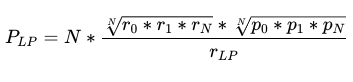

# Fair LP Token Oracles

Switchboard now offers fair LP token pricing oracles based on the work of Alpha
Finance Lab!

## The Concern

A liquidity pool is a collection of funds locked in a smart contract, used to
facilitate decentralized trading, lending, and many more functions [1]. With
DeFi we are able to deposit assets into an LP pool, receive yield bearing LP
tokens, and then borrow against our LP tokens. The price of these LP tokens is
typically calculated by summing the total liquidity in the pool and dividing by
the number of LP tokens issued. This basic calculation works well when the total
liquidity in the pool is balanced between each asset but starts to fall apart
when the pool liquidity is imbalanced.

Consider the WarpFinance incident where an attacker was able to use a flash loan
to manipulate the price of an LP token by taking advantage of the imbalance, for
which they used as collateral to borrow a greater amount of capital than was
sufficiently allowed [2]. This type of hack takes advantage of the LP token
price oracle in order to over-borrow from a lending provider.

<!--truncate-->

## The Solution

Thanks to Alpha Finance Lab we have a solution: Fair LP Token Pricing [3].

Where, r is the amount of reserves, and p is the given price, for each pool
member.

The fair LP formula takes into account the weight of each pool member’s
liquidity to determine a fair price. What that means is as a pool imbalance
grows, the price of the LP token decreases in order to lower the risk of flash
loan attacks being able to over-borrow against them.

Switchboard oracles now give you the option to calculate the fair price of an LP
token using the
[LpTokenPriceTask](https://docs.switchboard.xyz/architecture/task#lptokenpricetask).
Switchboard’s solution requires an existing aggregator for each pool member so
that the formula is always using the previous aggregator result for each pool
member’s price to prevent additional manipulation.

These feeds are live now so check out our feed explorer for an example of what
these on-chain jobs look like:

- [LP MERCURIAL USDC USDT PAI](https://switchboard.xyz/explorer/0/DhfLLj2NeBHBN2t7ksjwiZjpigzzTPSX9fwEiXyV9zDc)

- [LP MERCURIAL USDC USDT wUST](https://switchboard.xyz/explorer/0/2WUiZrSqyyfz65o36hmYw8XDXzTtGjt8qK7Co67E8km9)

- [LP SABER USDT USDC](https://switchboard.xyz/explorer/0/GnTHvhe4opQXHL4JGgDpfQKk2JY1ugmVLWvJocTH639q)

- [LP SABER wUST USDC](https://switchboard.xyz/explorer/0/AgChoQ3C9Zj68p6qrEs9ffp1dHcBsgFnw5jA3oWcq1c)

- [LP SABER mSOL SOL](https://switchboard.xyz/explorer/0/6ZuSuX14mxyZQ8JgjAC9PoDcbAU9sr1umUoyYVseVaNF)

- [LP ORCA SOL USDC](https://switchboard.xyz/explorer/0/EX8SxM4XcJyYBf6JWZArQkemXHNf88Z4CpDqDC8VdnKr)

- [LP ORCA USDC USDT](https://switchboard.xyz/explorer/0/DSPkZDVs4d5qMqThBCNUzemnUjgSPBjbGxL9otDfcjyB)

- [LP ORCA mSOL SOL](https://switchboard.xyz/explorer/0/DrKZHV8aRb9RNtjwGwJe3LBzemVqzJB1X7Z52dm4m7w)

- [LP RAYDIUM SOL USDC](https://switchboard.xyz/explorer/0/WppSmFsZqKGzJcUL9vcU3VJTYpa2BXF6QEiRUVZjRDz)

## References

- [1]
  [https://academy.binance.com/en/articles/what-are-liquidity-pools-in-defi](https://academy.binance.com/en/articles/what-are-liquidity-pools-in-defi)

- [2]
  [https://peckshield.medium.com/warpfinance-incident-root-cause-analysis-581a4869ee00](https://peckshield.medium.com/warpfinance-incident-root-cause-analysis-581a4869ee00)

- [3]
  [https://blog.alphafinance.io/fair-lp-token-pricing/](https://blog.alphafinance.io/fair-lp-token-pricing/)
