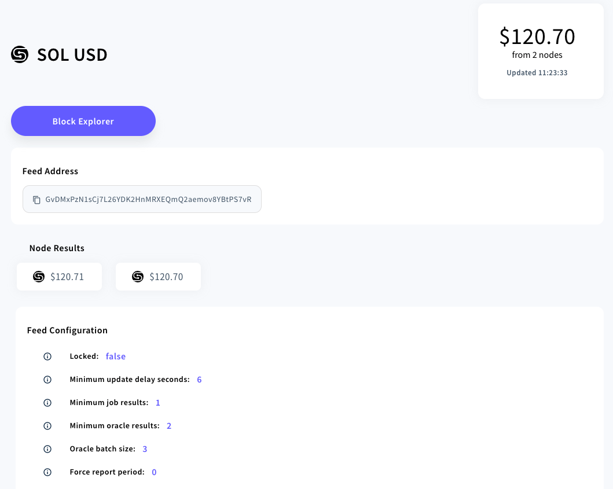

# Switchboard Introduces TWAP Support

| TWAP! TWAP! TWAP! Switchboard V2 now supports aggregator history

### What is TWAP?

A time weighted average price (TWAP) is the average price of an asset over a
specified time frame. Let’s say you’re a large trader and you want to enter a
large SOL/USD position. If you execute a sudden market order, you could drain
the order book and end up paying substantially more for the trade, plus bots
will immediately start to arbitrage and your position will be underwater
immediately. If you execute the same position using a TWAP, your orders will be
spread throughout the given timeframe, allowing the market to absorb your
liquidity, and giving you a more optimal price of the true market value.

TWAP use cases extend beyond just trading. Here are just a few examples of how a
TWAP could be used in DeFi to reduce oracle price manipulations:

- **Funding Premiums:** Using a TWAP over a random sample to avoid a single
  sample skewing the results

- **Futures Expiry:** Futures expiration are correlated with higher volatility.
  Using a TWAP reduces the risk of manipulation or
  [banging the close](https://www.cftc.gov/LearnAndProtect/EducationCenter/CFTCGlossary/glossary_b.html#:~:text=Banging%20the%20Close%3A%20A%20manipulative,position%20in%20an%20option%2C%20swap).

- **Lending Liquidations:** A TWAP reduces scam wicks causing erroneous lending
  position liquidations.

- **On-Chain Trading Algos:** An on-chain program could use a Switchboard TWAP
  oracle to execute positions on Serum based on a given criteria.

<!--truncate-->

### How to Use TwapTask?

To start using the new TwapTask with Switchboard V2, you will need to initialize
a history buffer account for your aggregator. You can initialize a history
buffer using the
[javascript API method setHistoryBuffer](https://docs.switchboard.xyz/api/switchboardv2-api/classes/AggregatorAccount#sethistorybuffer).
A history buffer account stores a set number of accepted results for an
aggregator, and given Solana’s maximum account size of 10MB, the maximum number
of samples a single history buffer can support is 350,000 samples (Keep in mind
rent cost, this action is currently irreversible). The screenshot below shows
the
[SOL/USD feed](https://switchboard.xyz/explorer/3/GvDMxPzN1sCj7L26YDK2HnMRXEQmQ2aemov8YBtPS7vR)’s
price history in action on our explorer page.

Once a history buffer has been initialized for an aggregator, you can create a
separate aggregator to track its TWAP. You can have multiple TwapTask tied to a
single aggregator/history buffer. The
[TwapTask](https://docs.switchboard.xyz/api/tasks#-twaptask) accepts the
following values:

- **_aggregatorPubkey_**: The public key of the aggregator that has a history
  buffer initialized

- **_period_**: The time period, in seconds, to include in the TWAP calculation

- **_weightByPropagationTime_** (Optional): Return the average, weighing each
  sample by the sample’s propagation time (currentTimestamp —
  previousTimestamp).

- **_minSamples_** (Optional): The minimum number of samples that must be
  present in the history buffer, after filtering by time period, before
  accepting a result

The TwapTask first filters the history buffer and excludes any samples failing
outside the set time period. If the minSamples field is set and the number of
samples in the filtered list is less than the minSamples, the oracles will not
report a result. The oracle will then calculate the final value by taking the
weighted average between each sample’s interval. You can find an example of the
TwapTask in our
[Job Directory](https://docs.switchboard.xyz/job-directory#twap).

### Known Limitations

The TwapTask relies on accepted on-chain results being pushed to the history
buffer. During periods of network degradations, aggregators may fail to post
accepted results due to an insufficient number of oracle responses. This may
cause TWAP calculations to have insufficient data to make a proper calculation.
To mitigate this, you should specify a minSamples field in the job definition to
only accept a TWAP result if enough samples are provided.

Check out our docs for a full list of tasks Switchboard supports:
[docs.switchboard.xyz/api/tasks](https://docs.switchboard.xyz/api/tasks)

Or view our currently supported on-chain feeds:
[switchboard.xyz/explorer](https://switchboard.xyz/explorer).
